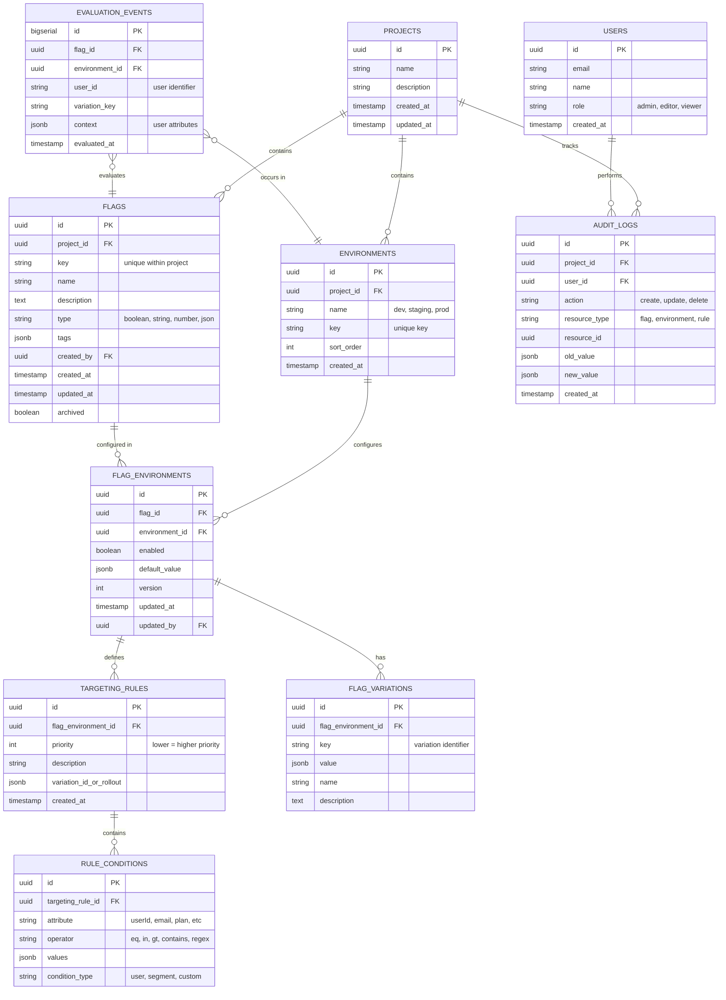

# Database Schema

## Real-time Infrastructure (Redis)

In addition to PostgreSQL for persistent storage, Solid Fortnight uses **Redis** as a messaging backbone for real-time flag synchronization.

### Pub/Sub Channels

| Channel | Description | Payload |
| :--- | :--- | :--- |
| `environment_updates` | Broadcasts flag changes to the Streamer service | `{"environment_id": "uuid"}` |

### Role in Architecture

1.  **Management API**: Publishes an event to `environment_updates` whenever a flag's configuration or variation is modified.
2.  **Streamer Service**: Subscribes to the `environment_updates` channel and pushes SSE updates to all clients connected to the affected environment.
