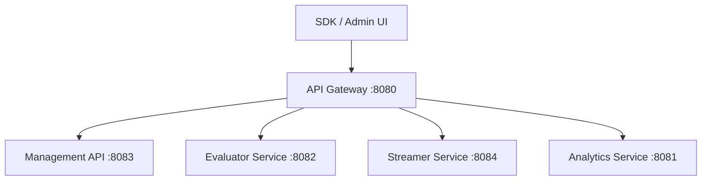

# API Gateway Service

The API Gateway is the central entry point for all external requests to the Solid Fortnight system. It handles request routing, service discovery, logging, and security.

## 1. Overview

The Gateway is a high-performance reverse proxy built in Go. It simplifies the client-side experience by providing a single URL (on port 8080) for all services, while managing internal complexity like path mapping and service host resolution.

## 2. Architecture



## 3. Path Mappings

The Gateway maps incoming requests under the `/api/v1` prefix to the corresponding internal services:

| Public Path | Internal Service | Internal Path |
| :--- | :--- | :--- |
| `/api/v1/management/*` | Management | `/*` |
| `/api/v1/evaluate` | Evaluator | `/api/v1/evaluate` |
| `/api/v1/stream` | Streamer | `/stream` |
| `/api/v1/analytics/*` | Analytics | `/api/v1/*` |

## 4. Middleware Stack

Every request passing through the gateway is processed by a chain of middlewares:

1. **Logger**: Records request method, path, and remote address.
2. **Auth**: Validates `X-API-Key` or `Authorization: Bearer <token>` headers.
3. **RateLimit**: (Placeholder) Prevents abuse by limiting request frequency.

## 5. Configuration

The Gateway uses environment variables for service discovery:

- `MANAGEMENT_HOST`: Hostname for the management service (default: `localhost`).
- `EVALUATOR_HOST`: Hostname for the evaluator service (default: `localhost`).
- `STREAMER_HOST`: Hostname for the streamer service (default: `localhost`).
- `ANALYTICS_HOST`: Hostname for the analytics service (default: `localhost`).

In the Docker Compose environment, these are automatically set to the respective service names.

## 6. Development

### Running Locally

```bash
make run-gateway
```

### Testing

```bash
go test -v ./apps/gateway/...
```
